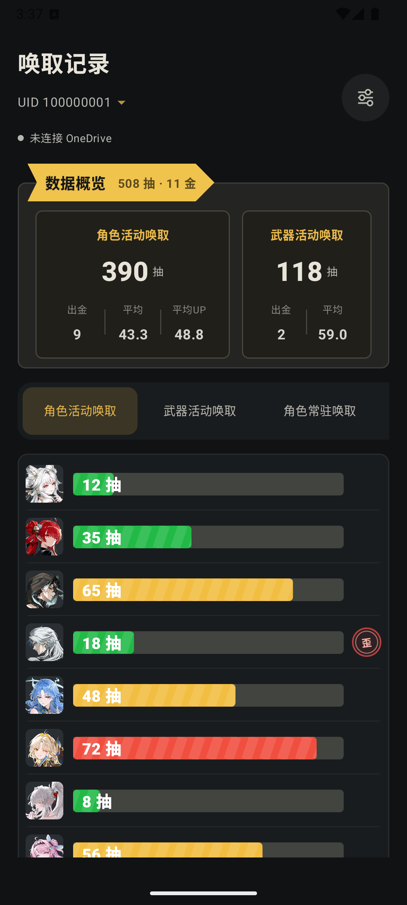
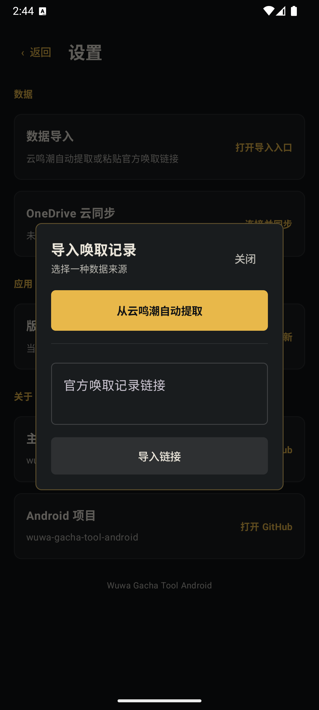
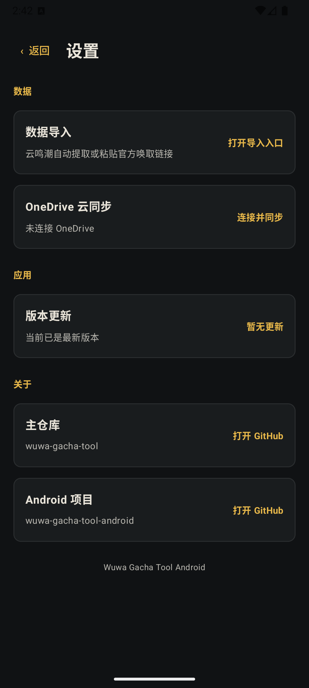

# Wuwa Gacha Tool Android

《鸣潮》抽卡记录的 Android 展示与导入客户端。应用将记录按 UID 与卡池独立保存，提供当前垫抽、五星记录与角色获取详情；需要跨设备使用时，可通过 OneDrive 同步与桌面端共享的数据快照。

> 以下截图均在 Android Virtual Device 上使用演示数据采集。图中 UID `100000001` 为虚构示例，不对应任何真实玩家；截图未包含官方唤取链接、OneDrive 设备码或登录凭据。

## 相关仓库

- [主程序（桌面端）](https://github.com/juliy819/wuwa-gacha-tool)：完整的桌面端记录管理与分析功能
- [Android 客户端](https://github.com/juliy819/wuwa-gacha-tool-android)：本仓库，面向 Android 的记录展示、导入与同步
- [Resources](https://github.com/juliy819/wuwa-gacha-tool-resources)：角色、武器目录与图片资源包
- [OCR Runtime](https://github.com/juliy819/wuwa-gacha-tool-ocr-runtime)：桌面端按需使用的 OCR 组件

---

## 核心功能

- **按 UID 与卡池查看记录**：账号独立存储，展示角色活动、武器活动及常驻卡池的记录与五星结果。
- **垫抽与五星概览**：汇总总抽数、五星数、各池平均值和当前垫抽；不同卡池互不混算。
- **五星获取详情**：点击五星记录可查看该角色的获取次数、前置歪池、总抽数与平均成本。
- **两种导入入口**：在云鸣潮登录后自动提取官方唤取链接，或直接粘贴官方链接导入。
- **OneDrive 云同步**：与桌面端使用同一份 `sync/v1` 数据库快照；检测到双方均有更新时会停止同步，避免覆盖。
- **本地资源与更新**：后台刷新资源包缓存，支持检查 Android 应用更新。

## 界面导览

### 唤取记录与数据概览



首页会显示当前 UID 的总抽数、五星数量与角色/武器活动池摘要。下方可横向切换卡池，查看当前垫抽和五星记录；点击五星记录可进入获取详情。账号选择器只列出本机已经导入记录的 UID。

### 导入唤取记录



从设置中的“数据导入”进入。可选择“从云鸣潮自动提取”，在内置 WebView 中完成云鸣潮登录后由应用识别官方唤取链接；也可以直接粘贴官方唤取记录链接导入。

官方链接属于敏感信息，不应分享或写入 Issue、截图和日志。应用按 UID、卡池、时间与同秒顺序合并记录，以避免重复导入并保留同秒多抽的顺序。

### 设置与云同步



设置页集中提供导入、OneDrive 连接与同步、版本更新以及仓库入口。首次连接 OneDrive 后，应用会在 OneDrive 根目录创建 `Wuwa Gacha Tool` 文件夹，并使用其中的 `gacha-data.db` 与桌面端同步。

## 推荐使用流程

1. 在设置中打开“数据导入”。
2. 使用云鸣潮自动提取，或粘贴完整的官方唤取记录链接。
3. 回到首页确认 UID、卡池、当前垫抽和五星记录。
4. 需要在桌面端与手机间共享数据时，连接 OneDrive 并完成首次同步。
5. 后续导入后再次同步；双方均修改过数据时，先在其中一端确认最新数据后再重试，避免快照冲突。

## 数据、隐私与同步边界

- 抽卡记录由 Room 保存在应用私有存储中，按 UID 与官方 `card_pool_type` 隔离。
- 应用不向项目自建服务器上传抽卡记录。导入时仅请求官方唤取记录接口；云鸣潮方式只用于取得官方链接。
- 启用 OneDrive 后，上传的是共享 SQLite 快照 `Wuwa Gacha Tool/gacha-data.db`，包含记录、导入状态与卡池历史边界，不包含设备路径、资源缓存、同步基线或凭据。
- OneDrive 使用公开客户端与 `offline_access`、`Files.ReadWrite` 权限。Android 端的刷新令牌以 Android Keystore AES-GCM 加密后存放在私有偏好中，访问令牌只留在内存。
- 下载云端快照后，应用会在替换本地数据前检查文件大小、SQLite 完整性、schema 和必要表结构；校验失败不会覆盖本机数据。
- 同步以数据库快照为单位，并非离线记录逐条合并。发现云端与本机同时变更时会停止操作，避免“后写覆盖先写”。协议细节见 [docs/cloud-sync-v1.md](docs/cloud-sync-v1.md)。

## 注意事项

- Android 当前聚焦记录展示、云鸣潮/官方链接导入与 OneDrive 同步；桌面端的 OCR、JSON 导入导出、批量手动补录、详细分析和本地游戏日志扫描不在 Android 客户端范围内。
- 请只在可信设备上输入官方唤取记录链接。链接可能包含 UID 与临时授权参数，过期后需要重新从游戏或云鸣潮取得。
- 使用云鸣潮自动提取时，需要在内置页面完成官方登录流程；请遵循云鸣潮的账号与登录限制。
- 资源图标由独立资源包提供。资源尚未缓存或缺失时，界面会使用降级展示，不影响记录本身保存。

---

## 本地开发

### 环境要求

- JDK 17
- Android SDK 35
- Android Studio 或已配置的 Android SDK 命令行工具

### 构建与测试

Linux/macOS：

```bash
export ANDROID_HOME=/path/to/Android/Sdk
./gradlew testDebugUnitTest assembleDebug
```

Windows PowerShell：

```powershell
$env:ANDROID_HOME = 'C:\\Android\\Sdk'
.\\gradlew.bat testDebugUnitTest assembleDebug
```

Debug APK 输出位置：

```text
app/build/outputs/apk/debug/app-debug.apk
```

### 安装到模拟器或设备

设备已通过 ADB 连接时：

```bash
adb install -r app/build/outputs/apk/debug/app-debug.apk
adb shell am start -n com.wuwa.gachatool/.MainActivity
```

也可以使用 Android CLI 部署：

```bash
android run --apks=app/build/outputs/apk/debug/app-debug.apk --device=<serial> --activity=com.wuwa.gachatool.MainActivity
```

### OneDrive 构建配置

项目内置公开的 OneDrive Client ID，普通本地构建无需额外配置。需要替换应用注册时，可使用 Gradle 属性或环境变量覆盖：

```bash
./gradlew assembleDebug -PWUWA_ONEDRIVE_CLIENT_ID=<client-id>
```

Client ID 不包含客户端密钥；不要将访问令牌、刷新令牌、设备码、完整 Graph 响应或官方唤取链接提交到仓库。
